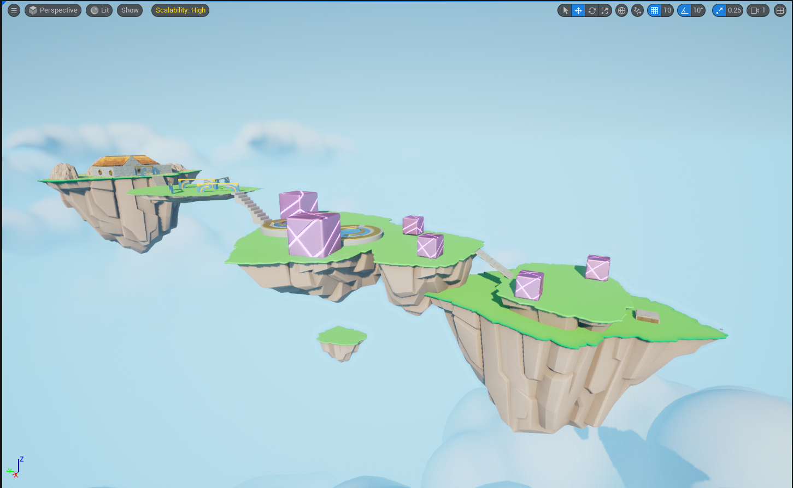
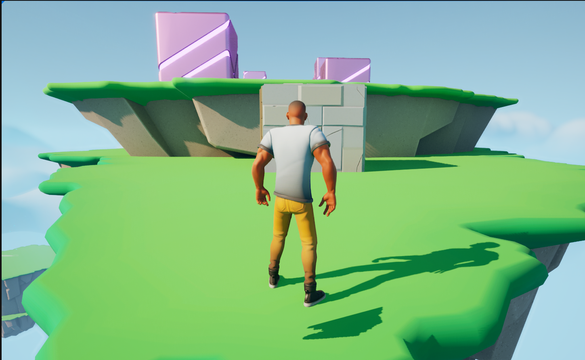

# Obstacle Assault - Unreal Engine 5

This project is a game level created in **Unreal Engine 5** to demonstrate my ability to work with the engine. It is not meant for commercial use or distribution but serves as a showcase of my skills in game development.

## About the Project

- The level design is inspired by obstacle courses similar to **Fall Guys**, utilizing assets to create a fun and challenging environment.
- I have used **LearningKit_Games** and **SCK_Casual01** publicily available assets to design and build the level.
- This project focuses on level design, asset integration, and gameplay mechanics in Unreal Engine 5.

## Purpose

This project is meant solely to demonstrate my proficiency with **Unreal Engine 5** and showcase my ability to design engaging and visually appealing game environments.

## Screenshots

  

---

This is a personal showcase and is not intended for public use or distribution. If you have any questions or feedback, feel free to reach out!
